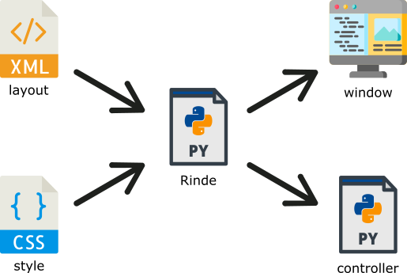

# rinde
Rinde is an amazing Python library used for creating GUI based on XML and CSS.

### How does it work?
Rinde can speed-up your work and build an application's window.

All you have to do is to create a script file (controller) which handles logic of your application, and two files which define layout and style of the window.

### Documentation
If you don't know how to use Rinde, look into [documentation](https://r0jsik.github.io/rinde/) site.

### Requires:
* Python 2.7 or 3.x
* cssutils
* pygame
