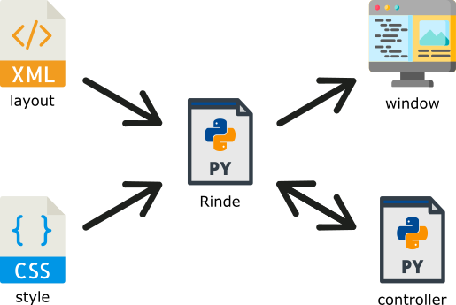

# rinde
Rinde is an amazing Python library used for creating GUI based on XML and CSS. Rinde can speed-up your work and build an application's window in a **really** simple way.

### Installation
`pip3 install rinde`

##### Requires:
* Python 3
* `pip3 install cssutils`
* `pip3 install pygame`

### How does it work?
All you have to do is to create a script file (controller) which handles logic of your application, and two files which define layout and style of the window.

Let's create 4 files:

##### \_\_init\_\_.py
    import rinde
    rinde.Application('Window title, 'scene_directory')

##### scene_directory/layout.xml
    <?xml version="1.0" encoding="UTF-8" ?>

    <Scene controller="controller.Controller" width="320" height="480">
        <!-- node declarations -->
    </Scene>

##### scene_directory/style.css
    /*
     * There will be placed all style declarations of your scene nodes.
     */

##### controller.py
    from rinde.scene import ControllerBase
    
    class Controller(ControllerBase):
        def start(self):
            # Method invoked when the window appears

### Example applications
There are 3 ready-to-run applications provided with the library. Let's check _example\_1_, _example\_2_ and _example\_3_ directories and just run its \_\_init\_\_.py files.

### Documentation
How to use this library? Where is the list of available nodes, its descriptions and list of their style properties? Are there any tutorials? Yeah, there are! More details are available at this [documentation site](https://r0jsik.github.io/rinde/).
